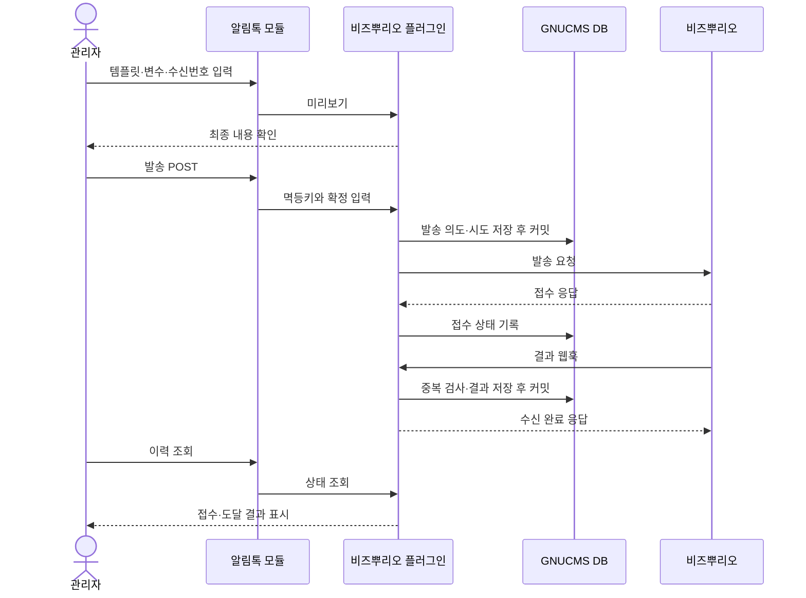

# 비즈뿌리오 알림톡 플러그인·모듈 구현 계획

작성일: 2026-09-06. 상태: 1차 구현·모의 API 검증 완료. 실계정 수신 검증과 기존 DB별 회귀 오류 해결은 정식 릴리스 전 별도 필요.

GNUCMS에서 재사용 가능한 알림톡 발송 플러그인과 관리자용 알림톡 운영 모듈을 만든다.
사용자의 진행 지시에 따라 1차는 관리자 단건 발송과 결과 확인으로 구현하며,
계정·발신프로필·승인 템플릿이 없어도 모의 HTTP 응답으로 개발할 수 있도록 한다.
실제 발송 검증은 별도의 완료 조건이며 모의 테스트 통과와 구분한다.

### 구현 검증 기록 (2026-09-06)

- 웹발송 계정 기능 반영 후 SQLite 전체 PHPUnit: 627개 테스트, 2,701개 단언 통과.
- 웹발송 계정 추가 후 SQLite·MySQL·PostgreSQL 플러그인/운영 화면 회귀:
  46개 테스트, 461개 단언 통과. 인증 확인 전 차단, 인증 캐시를 우회한 재확인,
  인증 거부 시 발송 정지, 설정 변경·복원 후 확인값 해제, 웹발송 화면과 사이트 진입을 검증했다.
- SQLite·MySQL·PostgreSQL 관련 회귀: 124개 테스트, 692개 단언 통과.
  확장 설치·재실행·부분 실패, 접두사, 모의 인증·발송·웹훅, 관리자 권한·CSRF·본문 변조,
  SQLite 복원과 MySQL/PG 네이티브 백업에 확장 테이블을 포함하는 경로를 확인했다.
- 세 DB 전체 회귀 실행(1,375개)에서는 오류 44개와 실패 9개가 있었다.
  변경 전 `a88b773`과 현재 코드에서 해당 테스트를 분리 재실행했고, 106개 테스트 중
  같은 53개가 같은 종류로 실패했다. 기존 PostgreSQL의 시퀀스 없는 설정 테이블 INSERT,
  DB별 관리 화면·검색 기대값 문제이며 이번 변경에서 임의로 수정하거나 숨기지 않았다.
  따라서 세 DB 전체 통과 또는 정식 릴리스 준비 완료로 간주하지 않는다.
- 변경 PHP 44개 문법 검사, 패키지 JSON, `git diff --check` 및 새 파일 공백 검사를 통과했다.
- 운영 의존성과 정적 자산을 포함한 검토용 ZIP을 개발 환경에서 준비했다.
  실제 API 인증·과금·카카오 수신·업체 웹훅 ACK 계약은 계정 준비 후 확인해야 한다.

## 1. 권장 범위와 역할

| 패키지 | 책임 | 의존성 |
| --- | --- | --- |
| `plugins/bizppurio` | 설정·인증·템플릿 검증·발송·발송 이력·결과 수신·공개 서비스 | GNUCMS 확장 기반 |
| `modules/alimtalk` | 관리자 템플릿 설정·미리보기·수동 발송·이력 조회 화면 | `requires: ["plugins/bizppurio"]` |
| 향후 업무 모듈 | 수신자·발송 시점·업무 변수 결정 | 발송이 필수이면 `requires`, 부가 기능이면 `optional` |

발송 이력과 템플릿 저장은 플러그인이 소유한다. 운영 모듈을 거치지 않은 다른 업무 모듈의
발송도 같은 검증·중복 방지·결과 추적을 사용한다. 운영 모듈은 플러그인의 DB 테이블이나
내부 PHP 클래스를 직접 참조하지 않는다. 기존 데모 패키지는 별도로 유지한다.

### 1차에 포함

- 전체 관리자 전용, 국내 번호 대상 단건 즉시 발송.
- 검수/운영 환경별 설정, 발송 허용 스위치, 인증 연결 확인.
- 계정 유형(모듈 연동/웹발송) 저장, 웹발송 계정의 인증 확인 후 발송 허용, GNUCMS 웹발송 화면의 계정 상태 표시.
- 비즈뿌리오 사이트 직접 웹발송 진입 링크. 사이트 로그인·발송·이력 확인은 해당 사이트에서 수행한다.
- 일반 발신프로필과 승인된 기본 텍스트형 템플릿 수동 등록.
- 본문 변수와 웹링크 버튼(WL, 최대 5개)의 변수 치환·미리보기.
- 발송 접수와 도달 결과의 구분, 웹훅 수신, 결과 재요청, 실패 사유 표시.
- 중복 제출 방지, 불명확한 발송의 자동 재전송 차단, 설정·이력 백업.
- 계정 없는 개발용 모의 테스트. 비활성 패키지의 관리자 테스트는 제공하지 않는다
  (`admin_test: false`). 활성 상태의 미리보기와 실발송 화면을 구분한다.

### 후속 단계

1. KAPI 템플릿 목록·상세 조회와 상태 동기화.
2. SMS/LMS 대체 발송과 채널별 결과 표시, 필요 시 Polling.
3. 선정한 업무 이벤트 1종의 자동 발송, 수신번호 관리, 발송 대기열.
4. 필요가 확인되면 이미지·강조·아이템리스트·추가 버튼 유형, KAPI 등록·검수 관리.

대량 CSV 발송, 주소록, 국제 발송, 광고성 브랜드메시지, 예약 시스템 자체 개발,
업체 예약 발송·취소는 1차 범위에 넣지 않는다.

웹발송 계정의 GNUCMS 내 전송은 REST API 사용 권한이 있는 경우에 지원한다.
별도 웹발송 전용 API는 공개 규격을 확인하지 못했으므로 구현하거나 호환성을 보장하지 않는다.
사이트 발송 이력의 자동 동기화도 포함하지 않는다. 계정 유형 명칭만으로 API 권한을
추정하지 않고 실계정 인증·알림톡 발송·수신 검증을 별도 완료 조건으로 유지한다.

## 2. 확인한 외부 규격

확인 문서는 BIZAPI v3.11.2, KAPI v4.18이다. 버전 표시와 각 endpoint의 경로 버전은
서로 다르므로 문서 버전을 URL에 대입하지 않는다.

| 용도 | 규격 요점 |
| --- | --- |
| 인증 | `POST /v1/token`, 계정·암호 Basic 인증, Bearer 토큰 발급 |
| 발송 | `POST /v3/message`, `type=at`, `content.at` |
| 결과 재요청 | `POST /v2/report`, 저장된 결과를 웹훅으로 재전달 |
| 선택적 Polling | `/v1/result/request` 수집 후 `/v1/result/confirm` 완료 처리 |

본문은 변수 치환을 마친 문자열이며 템플릿에 있는 버튼 등도 전송해야 한다.
웹훅 필드는 대문자, Polling 필드는 소문자다. 웹훅에는 별도 인증 헤더가 없으며,
공식 가이드는 URL 토큰 또는 발신 IP 제한을 제시한다.
[BIZAPI 규격](https://bizppurio.github.io/bizapi/)

KAPI는 `https://kapi.ppurio.com`에 본문의 `bizId`·`apiKey`로 인증한다.
성공 코드는 문자열 `200`이다. 목록은 `/v3/kakao/template/list`, 상세는
`/v3/kakao/template/detail`을 사용한다. 상세의 검수·차단·휴면 상태도 확인해야 한다.
KAPI는 발송 API가 아니다. [KAPI 규격](https://bizppurio.github.io/kapi/)

발송 API `1000`은 접수, 카카오 결과 `7000`은 성공이다. `7305`는 성공 불확실,
`7307`은 지연이므로 실패로 단정하지 않는다. `7204`·`7327`은 본문·버튼 불일치의
대표 사례다. [응답 코드](https://bizppurio.github.io/response-codes/)

토큰은 24시간 유효하며 접속 IP 등록이 필요하다. 웹훅 복구 가능 기간은 35일,
Polling 미처리 결과 보관은 3일이다. [운영 가이드](https://bizppurio.github.io/guides/operations/)

### 구현 전에 업체에 확인할 사항

| 항목 | 발견한 불일치·불확실성 | 계획의 기본 처리 |
| --- | --- | --- |
| 본문 길이 | API의 1,300자와 가이드의 1,000자 기준이 혼재 | 1차는 치환 후 1,000자 제한, 상향은 검수 후 |
| 호출 제한 시간 | `RateLimit-Reset`의 ms 표기와 소수 예시·대기 예제가 모호 | 단위 확인 전 헤더를 임의 해석하지 않고 제한된 백오프 사용 |
| 템플릿 코드 | 발송 스키마 32자, KAPI 30자 | 새 로컬 등록은 30자로 제한 |
| 웹훅 | 실제 계정의 요청 샘플·응답 본문 조건·송신 IP·재시도 간격 | 수신 계약 테스트 확정 후 실발송 개방 |
| 접수 중복 | 같은 `refkey`의 서버 측 중복 발송 방지 보장을 확인하지 못함 | 로컬에서 방지하고 시간 초과 재전송 금지 |
| 계정 조건 | 검수 환경의 실수신/과금, `from` 등록 조건, 대체·Polling 권한 | 계정별로 확인하고 환경 간 자동 전환 금지 |

길이 차이는 [운영 가이드](https://bizppurio.github.io/guides/operations/),
필드·시간 표기는 [BIZAPI](https://bizppurio.github.io/bizapi/)와
[KAPI](https://bizppurio.github.io/kapi/)를 대조했다. 웹훅의 세부 운영 계약과
멱등성 보장은 문서에 없는 내용을 추정해 구현하지 않는다.

## 3. GNUCMS에서 확인한 제약

| 현재 코드·문서 | 확인 결과 | 계획에 미치는 영향 |
| --- | --- | --- |
| `src/Extension/Context.php` | 고정 GET/POST, 모든 POST에 세션 CSRF 검사 | 전용 외부 콜백 등록 기능 필요 |
| `src/Extension/Manager.php` | 활성 패키지만 서비스·라우트 등록 | 플러그인 OFF면 웹훅도 중단 |
| `src/Web/Middleware/SessionGuard.php` | 전체 요청에 세션·사용자 정보 준비 | 외부 콜백의 세션 없는 경로 설계 필요 |
| `docs/extensions.md` | 패키지 마이그레이션·주기 실행기 없음 | 명시적 설치/갱신 절차 필요, cron 필수화 금지 |
| `src/Maintenance/BackupManager.php` | MySQL/PG 덤프는 `Schema::TABLES`만 포함 | 별도 확장 테이블은 현재 백업에서 누락 |
| 같은 백업 코드 | SQLite는 DB 전체 복사, 확장 상태 파일·패키지는 별도 | DB별 백업 의미와 복구 절차 맞추기 |
| `src/Mail/SecretCipher.php` | 공통으로 재사용 중인 암호화 구현 | `auth.secret` 기반 암호화 재사용 |
| `src/Db/Schema.php` | 회원 전화번호 컬럼 없음 | 1차 수동 입력, 자동 발송 단계에서 수신번호 모델 추가 |
| `src/Service/NotificationService.php` | 사이트 내부 댓글·답글 알림 | 기존 알림함을 바로 외부 발송 큐로 사용하지 않음 |

패키지 전용 템플릿은 자체 화면을 사용하고, 현재 제공되지 않는 패키지 테마 재정의
기능을 지원한다고 표시하지 않는다. 공통 확장 관리 화면이 바뀌면 기본 테마와
`admin/_sidebar` 및 사용자 테마에 미치는 영향을 별도로 검증한다.

## 4. 필요한 공통 기반 변경

알림톡 전용 코드를 코어 `App`·`Routes`에 계속 추가하지 않도록 아래 기능을
독립적인 논리 변경으로 먼저 구현한다. 새 API 이름은 구현 시 최종 확정한다.

### 4.1 외부 콜백 등록

- `Context::externalPost()` 같은 명시적 등록 API를 추가한다. 인증 검증기를 필수로
  받으며, 기존 `route()`의 CSRF 동작은 유지한다.
- 확장 관리자가 실제 등록한 라우트 메타데이터로만 세션 없는 요청을 식별한다.
  URL 접두사만 보고 보안 검사를 생략하지 않는다.
- 콜백은 세션 쿠키·관리자 로그인과 무관하게 검증한다. 보안 검증이 끝나기 전에는
  업무 처리를 수행하지 않으며 JSON·상태코드 응답에 로그인 리다이렉트가 끼지 않게 한다.
- 비즈뿌리오 검증기는 별도 난수 URL 토큰을 상수 시간으로 비교한다. 확인된 송신 IP
  제한을 함께 적용할 수 있게 하고, 프록시 헤더는 신뢰 프록시 설정 없이 사용하지 않는다.
- 쿼리 토큰을 로그·분석·오류 화면·Referer에 노출하지 않는다. 콜백은 분석 제외,
  서버 접근 로그의 해당 URL 비밀값 제거 설정을 배포 문서에 포함한다.
- 요청 크기 제한, 메서드/Content-Type 검사, 잘못된 JSON·필드 거부를 적용한다.
  요청 제한이 본문 파싱 전에 적용되는지도 검증한다.

### 4.2 패키지 DB 마이그레이션

- 최소 공통 실행기와 영속 설치 레지스트리를 둔다. 레지스트리는 패키지 ID,
  설치된 schema 버전, 소유 테이블 목록, 설치/실패 상태를 기록한다.
- 패키지 자체가 DDL·멱등 마이그레이션을 소유한다. 코어는 검증·잠금·실행·상태 기록만 맡는다.
- 전체 관리자 POST의 명시적 설치/갱신 동작에서 실행한다. `bootstrap.php`, 목록 GET,
  공개 방문, 웹훅에서 DDL을 실행하지 않는다. 갱신이 필요하면 발송을 차단하고 안내한다.
- SQLite/MySQL/PostgreSQL과 DB prefix를 지원한다. MySQL DDL의 암묵 커밋을 고려해
  전체 롤백에 기대지 않고 실제 구조를 검사하며 재실행한다.
- 코어 업그레이드·백업과 잠금 순서를 통일한다. 설치 중인 데이터도 백업에서 조용히
  빠지지 않도록 실패 상태·실제 존재 테이블을 추적한다.
- 레지스트리 테이블을 코어에 추가할 때만 해당 구조 변경으로 `Schema::VERSION`을 올린다.
  이후 패키지 구조 판은 별도로 관리한다. `version.txt`는 직접 수정하지 않는다.
- 예전 GNUCMS에서 새 기능을 쓰는 패키지가 정상 실행 가능으로 보이지 않도록 확장 API
  호환성 선언을 마련한다. 예: 코어가 API 1·2를 지원하고 신규 패키지는 API 2를 요구.
  기존 데모의 API 1 계약은 유지한다.

### 4.3 백업·복구 연계

- MySQL/PG는 코어 테이블과 레지스트리의 실제 확장 테이블을 함께 덤프한다.
  비활성·패키지 파일 누락 상태에서도 저장 데이터가 포함되도록 패키지 PHP 실행에 의존하지 않는다.
- `storage/extensions/enabled.json`과 영속 확장 상태를 백업 대상으로 정의한다.
  토큰 캐시·잠금·임시 파일은 복구 대상에서 제외한다.
- 복구는 우선 기존 지원 범위인 SQLite에서 검증하고 MySQL/PG는 덤프와 수동 복원 절차를 검증한다.
  이번 기능으로 MySQL/PG 웹 자동 복원까지 지원한다고 표시하지 않는다.
- 확장 PHP 패키지는 배포 아티팩트와 버전 목록으로 재배치한다. 백업에 실행 코드가
  포함되지 않는다는 점과 키가 들어 있는 설정 파일의 복구 필요성을 명시한다.
- 복원·서버 복제 후 발송은 기본 정지로 둔다. 복구 전에 외부에 접수된 건을 재발송하지
  않도록 런타임 발송 허용값은 복원하지 않고 별도 재개 절차를 둔다.
  기존 서버에 복원하는 경우에도 복원 실행기가 허용값을 명시적으로 해제한다.
  파일 시스템 전체를 복제하는 수동 이전은 별도의 발송 정지 체크 절차를 따른다.

## 5. 플러그인 설계

### 구성과 서비스 계약

예상 구성: `bootstrap.php`, `extension.json`, `src/Http/`, `src/Auth/`,
`src/Template/`, `src/Dispatch/`, `src/Result/`, `src/Repository/`, `migrations/`,
`templates/`, `README.md`. 진입점은 클래스 로딩·서비스·라우트 등록만 한다.

| 공개 서비스 예시 | 입력·출력 계약 |
| --- | --- |
| `preview.v1` | 템플릿 ID·변수 → 치환된 본문·버튼·검증 결과. 저장·외부 호출 없음 |
| `send.v1` | 멱등키·템플릿 ID/판·수신번호·변수·업무 참조 → 내부 ID·접수 상태 |
| `templates.v1` | 허용된 템플릿 작업 → 로컬 설정·조회 결과 |
| `history.v1` | 검증된 검색 조건 → 페이지 단위 이력·상세 |
| `refresh-result.v1` | 내부 발송 ID → 결과 재요청의 접수 상태 |

서비스는 버전 있는 `Closure` 계약으로 공개하고 입력/출력 배열 구조를 PHPDoc과
계약 테스트로 고정한다. 소비자는 자격증명·senderkey·업체 URL을 직접 주입하지 못한다.
업무 참조는 짧은 식별자만 받고 임의 회원 객체·개인정보 덩어리를 저장하지 않는다.
웹 요청자의 권한은 컨트롤러에서 검사하고 발송 허용·입력 검증·중복 방지는 서비스에서
다시 보장한다. 다른 PHP 패키지는 신뢰 코드라는 기존 확장 모델을 유지한다.

### 설정·통신

- 1차는 환경마다 계정·프로필 1개로 시작한다. 운영/검수의 자격증명·캐시·템플릿·이력을 분리한다.
  발송 호스트는 운영 `https://api.bizppurio.com`, 검수 `https://dev-api.bizppurio.com`으로
  고정한다. [BIZAPI 환경 규격](https://bizppurio.github.io/bizapi/)
- 계정 암호·KAPI 키·웹훅 토큰은 암호화하고 설정 화면에서는 저장 여부만 표시한다.
  계정 변경 시 기존 결과에 필요한 연결 정보를 잃지 않도록 미완료 건을 검사한다.
- 토큰 캐시는 계정·환경·설정 판에 묶고 만료 전에 갱신한다. 동시 갱신 잠금과
  설정 변경 시 무효화를 구현하며 토큰을 화면·로그·fixture에 남기지 않는다.
- HTTP 클라이언트를 주입 가능한 인터페이스로 둔다. 기존 의존성에서 사용할 구현을
  확인하고, 필요 의존성은 개발·CI에서 명시적으로 준비해 배포본에 포함한다.
- TLS 검증, 고정된 업체 호스트, 리다이렉트 금지, 응답 크기와 연결/응답 제한을 둔다.
  요청·응답 본문 전체와 Authorization을 공통 오류 로그로 흘리지 않는다.
- 401 등의 HTTP 코드만으로 판정하지 않고 공급자 응답 코드를 함께 해석한다.
  알 수 없는 코드·잘못된 JSON은 성공으로 취급하지 않는다.

### 템플릿

- 로컬 등록은 업체에 승인된 템플릿을 복사해 사용하는 설정이다. GNUCMS에서 승인했다는
  의미로 표시하지 않으며 `수동 등록 / 원격 미확인`을 구분한다.
- 고정 본문은 등록 단계에서만 바꿀 수 있고 발송 화면에서는 정의된 변수만 입력한다.
  수정 시 판을 올려 기존 미리보기와의 불일치를 감지한다.
- 변수 치환은 한 번만 수행한다. 누락·미정의 변수, 빈 값 정책, 중첩 치환,
  치환 후 길이, 버튼 개수·순서·타입·URL을 서버에서 검증한다.
- 일반 텍스트의 공백·줄바꿈을 임의로 trim·HTML 디코딩하지 않는다.
  URL 변수는 경로/쿼리 용도에 맞게 인코딩하고 최종 scheme과 허용 도메인을 검증한다.
- 지원하지 않는 강조형·이미지·바로연결 등이 있는 템플릿은 해당 요소를 버리고 보내지
  않고 발송 불가로 표시한다. 미리보기는 카카오 앱과 동일한 렌더링을 보장하지 않는다.
- 발송 시 템플릿 판·최종 본문·버튼을 스냅샷으로 보관한다.

### 데이터 모델 초안

테이블명은 DB prefix 포함 식별자 길이까지 고려해 짧게 정한다.
JSON 데이터는 DB 고유 JSON 연산 없이 TEXT로 보관하고 검색 필드는 별도 컬럼으로 둔다.

| 논리 테이블 예시 | 주요 데이터 |
| --- | --- |
| `bp_settings` | 환경·계정 설정 판·암호화된 비밀값·운영 제한 |
| `bp_templates` | 환경·프로필·템플릿 코드·종류·본문·버튼·변수 규칙·판·상태 출처 |
| `bp_dispatches` | 내부 ID·멱등키·요청 해시·환경/계정 판·수신정보·스냅샷·접수/도달 상태 |
| `bp_attempts` | 발송 ID·시도 순번·refkey·messagekey·HTTP/업체 코드·시각·불확실 여부 |
| `bp_receipts` | 수신 식별자·채널·결과 코드·발송 연결·수신/처리 시각·중복 판별 해시 |

수신번호와 최종 메시지/변수는 암호화하고 목록에는 번호 일부만 표시한다. 중복 판별용
번호 해시는 단순 SHA가 아닌 별도 용도의 키 기반 HMAC으로 만든다. 인증 비밀값은
발송 스냅샷에 복사하지 않는다. 에러 원문 대신 제한된 오류 분류를 저장한다.
발송 내용·수신정보의 기본 보관 기간은 90일을 제안하되 실제 운영 정책으로 확정한다.
만료 후 개인정보를 제거해도 멱등키·최소 결과 식별자는 업무 중복 방지 기간까지 유지한다.
시각은 UTC로 저장하고 관리자 화면에서 한국 시간으로 표시한다. 보관 만료 처리는
관리자 POST의 제한된 배치로 먼저 제공하며 자동 정리는 주기 실행 단계에서 추가한다.

## 6. 발송과 결과 처리

### 멱등성·장애 경로

1. 동일 멱등키의 동시 제출은 DB UNIQUE 제약과 조건부 상태 변경으로 1건만 발송한다.
   같은 키에 다른 내용이 들어오면 충돌 오류를 반환한다. 페이지 새로고침은 재발송이 아니다.
   업체 전달용 refkey는 개인정보가 없는 32자리 ASCII 난수로 생성하고 로컬 업무 멱등키와 분리한다.
2. 네트워크 호출 전에 발송 의도를 커밋하고 DB 트랜잭션을 연 채 외부 응답을 기다리지 않는다.
   상태는 `prepared → sending → accepted/rejected/unknown`으로 구분한다.
3. 연결 단절·시간 초과·성공 응답 저장 실패·장시간 남은 `sending`은 `unknown`으로
   취급한다. 프로세스 재시작이나 화면 재요청으로 자동 발송하지 않는다.
4. 공급자가 명확히 거절한 인증 만료에 한해 토큰 갱신 후 1회 시도할 수 있다.
   명확한 호출 제한 응답은 시도 횟수·다음 허용 시각을 저장한다. 1차는 관리자 POST로
   재시도하고, 5xx·불명확한 응답은 중복 접수 가능성을 먼저 검토한다.
5. 도달 상태는 접수와 별도로 `pending/delivered/failed/uncertain`을 둔다.
   결과 지연·성공 불확실을 영구 실패로 바꾸지 않는다.
6. 결과가 접수 응답보다 먼저 와도 처리할 수 있게 refkey와 발송 의도를 먼저 연결한다.
   messagekey/CMSGID, 환경·계정, 수신번호도 대조하며 refkey 하나만 믿지 않는다.
7. 중복 웹훅은 재발송·중복 집계를 유발하지 않는다. 같은 MSGID의 상태 보정 가능성을
   고려해 수신 식별자와 내용 해시를 보관하고 상충 이벤트는 추적한다.
   미매칭 결과는 제한된 크기로 격리하며 새로운 발송 건을 만들지 않는다.
8. 웹훅은 외부 HTTP 호출 없이 짧은 DB 작업으로 결과를 내구성 있게 저장한 다음 응답한다.
   저장 실패에는 성공 ACK를 보내지 않는다. 대규모 비동기 큐가 없는 1차에도 이 원칙을 지킨다.
9. 결과 재요청은 접수된 메시지의 결과 복구 기능으로만 제공한다. messagekey가 없는
   `unknown` 건은 업체 발송 조회와 대조할 대상으로 표시한다.

### 정지와 복구

`발송 정지`는 신규 요청과 재시도를 차단하면서 웹훅·이력 조회를 유지한다.
완전한 플러그인 OFF는 기존 규약대로 라우트도 중단하며 외부 접수 건을 취소하지 않는다.
운영 중에는 발송 정지 → 미완료 건 확인 → 모듈/플러그인 OFF 순서를 안내한다.
계정 교체·사이트 복제·백업 복원 시 과거 발송과 현재 발송을 분리하고 토큰을 새로 발급한다.

## 7. 관리자 모듈 화면

| 화면 | 내용 |
| --- | --- |
| 플러그인 설정 | 환경·계정·발신프로필·발신번호·인증 확인·결과 URL·발송 정지 |
| 모듈 홈 | 준비 상태·미완료/불명확 건·최근 결과 |
| 템플릿 | 승인 템플릿의 로컬 등록·수정·사용 여부·변수 규칙 |
| 발송 | 템플릿 선택 → 변수/번호 입력 → 미리보기 → 발송 |
| 이력 | 기간·상태·템플릿 검색, 접수/도달 결과, 개별 상세 |
| 결과 복구 | 결과 재요청, 재요청 접수와 실제 웹훅 수신을 구분 |

고정 경로와 쿼리/POST ID를 사용한다. 예: `/modules/alimtalk/send`,
`/modules/alimtalk/history`, `/modules/alimtalk/detail?id=...`.
하위 디렉터리 설치에서도 생성 링크·폼·웹훅 주소가 맞아야 한다.
모든 관리자 변경 요청에 권한·CSRF·서버 검증을 적용하고 출력은 `$this->e()`로 이스케이프한다.
실발송은 활성 환경과 실제 수신번호를 확인하는 명시적 버튼으로만 수행한다.
초기 실발송은 지정된 테스트 번호만 허용하고 운영 개방 때 제한을 변경하도록 한다.

## 8. 후속 기능의 구체적인 경계

### KAPI 조회·동기화

- 선택적 KAPI 키를 추가하고 목록의 페이지 순회 후 상세를 가져온다.
- KAPI의 `linkType/linkMo/linkPc`를 발송용 `type/url_mobile/url_pc`로 명시적으로 변환한다.
- 검수·사용·차단·휴면을 종합 판정한다. 승인만으로 발송 가능을 단정하거나
  아직 첫 발송 전인 정상 템플릿을 일괄 차단하지 않도록 실제 샘플로 상태 표를 확정한다.
- 원격 확인 시각과 로컬 수정 여부를 표시하고 기존 발송 스냅샷은 덮어쓰지 않는다.
- 미지원 유형은 조회는 가능해도 발송은 차단한다. 동기화 실패/오래된 상태 정책을 설정한다.
- 등록·검수 요청·삭제·휴면 해제는 별도 단계로 둔다. 로컬 등록과 원격 등록 버튼을 혼동하지 않게 한다.

### 문자 대체와 Polling

- 대체는 기본 OFF다. 승인된 발신번호·계정 권한·별도 문자 본문·비용 정책 확인 후 연다.
- 업체 대체 발송을 요청했다면 GNUCMS가 같은 실패 건에 문자를 추가로 보내지 않는다.
- 원본 요청 아래 알림톡/문자 각각의 결과를 남긴다. 알림톡 실패만 보고 전체 실패로 확정하지 않는다.
- Polling은 사전 신청된 계정에서만 사용한다. 먼저 결과 저장을 커밋한 뒤 confirm하고
  confirm 실패의 재수신을 멱등 처리한다. 웹훅용 결과 재요청과 화면·서비스를 구분한다.

### 자동 발송

- 첫 업무 이벤트는 사용자가 선정한다. 게시판 답변, 예약 확정 등 이벤트 하나씩 추가한다.
- 회원 전화번호/인증·수신 설정 또는 업무 데이터의 번호 출처를 정한다. 탈퇴·번호 변경,
  비밀글 권한·삭제 상태를 전송 직전에 재확인하고 민감한 본문을 외부 메시지에 싣지 않는다.
- 실제 예약 저장이 없는 데모를 운영 예약 시스템처럼 연결하지 않는다.
- 업무 저장과 발송 대기열의 일관성을 보장하는 트랜잭션 경계를 먼저 설계한다.
  업무 트랜잭션 안에서는 외부 API를 호출하지 않고, 업무 이벤트 ID로 중복을 방지한다.
- cron은 선택 사항이다. 기본 단건 발송·웹훅에는 필요 없다. 향후 방문 기반 실행은
  무방문 지연을 표시하고, 정시성이 필요한 운영은 선택적 CLI/cron 실행으로 보완한다.
- 대기열 claim/lease·시도 상한·만료·정지·복구를 구현한다. 만료된 `sending`을
  자동 재발송 대기로 되돌리지 않고 불확실 상태로 분리한다.

## 9. 구현 순서와 완료 조건

| 순서 | 변경 단위 | 통과 기준 |
| --- | --- | --- |
| 0 | 범위·계정 체크, 외부 계약 샘플 확정 | 1차 템플릿 유형·번호 출처·웹훅 계약 기록 |
| 1 | 공통 외부 콜백 기반 | 기존 CSRF 유지, 인증 없는 콜백 거부, 하위 경로·JSON 오류 검증 |
| 2 | 확장 스키마·백업 기반 | 세 DB 설치/재실행/중간 실패/백업, API 1 확장 호환 |
| 3 | 플러그인 설정·인증·템플릿·발송 저장 | 모의 발송, 비밀값 비노출, 동시 중복 방지 |
| 4 | 웹훅·상태 전이·결과 복구 | 중복/역순/저장 실패/unknown 경로 검증 |
| 5 | 관리자 모듈 | 권한·CSRF·XSS·미리보기 후 수정·중복 클릭·사용 중지 흐름 |
| 6 | 검수 계정 실수신·배포 점검 | 승인 템플릿 수신과 웹훅 연결, 전체 테스트, 완성 ZIP 검증 |
| 7 | 후속 범위별 추가 | KAPI → 대체/Polling → 선정 업무 이벤트 순으로 별도 검증 |

1~2는 다른 확장도 쓸 수 있는 공통 변경으로, 3~5는 플러그인·모듈로 분리한다.
의존 관계가 있는 단계는 앞 단계가 통과한 뒤 진행한다. 계정 준비와 승인 대기 중에는
실수신을 제외한 모의 구현·검증을 진행할 수 있다.

### 회귀 테스트 목록

- 인증: 잘못된 계정·IP 거부·토큰 만료·동시 갱신·계정/환경 변경·깨진 응답.
- 템플릿: 변수 누락/여분·반복 변수·UTF-8·줄바꿈·치환 후 한도·버튼 URL·미지원 유형.
- 발송: 동시에 같은 멱등키·다른 내용의 같은 키·시간 초과·접수 직후 DB 실패·프로세스 중단.
- 결과: 잘못된 토큰/IP·중복/역순·미매칭·동일 MSGID의 보정·알 수 없는 코드·저장 실패.
- 권한: 비회원/일반회원 차단·CSRF·XSS·비활성 라우트·관리자 테스트에서 외부 호출 없음.
- DB: `connectionProvider`로 세 DB·prefix·UNIQUE 경쟁·설치/갱신 재실행·중간 실패 후 복구.
- 백업: OFF/파일 누락 확장 포함·불완전 설치 검출·SQLite 복원·MySQL/PG 덤프 대상·발송 재개 차단.
- 운영: 발송 정지 중 결과 수신·하위 경로·비밀값 없는 오류 로그·필수 의존성 OFF 방지.

변경별 관련 PHPUnit과 PHP 문법 검사를 먼저 실행한다. 공통 코드·DB·라우팅을 바꾸므로
전체 `./vendor/bin/phpunit`도 통과해야 한다. 지원 DB를 실행하지 못한 경우 검증 누락을
명시하고 해당 CI/실환경 검증을 릴리스 전 조건으로 남긴다.

배포본에는 패키지 파일·필요 `vendor/`·정적 자산을 넣고 운영 서버에서 설치/빌드를
요구하지 않는다. `docs/extensions.md`, 패키지 README, 샘플 설정, `AGENTS.md` 기능 지도는
실제 구현이 완료되는 변경에서 갱신한다. 릴리스 기록은 Release Please 흐름을 따른다.
모든 변경은 `git diff --check`와 민감정보·런타임 파일 제외 검사를 통과해야 한다.

## 10. 사용자 준비와 남은 결정

| 시점 | 사용자 준비 | 개발 측 작업 |
| --- | --- | --- |
| 지금 | 첫 발송 목적·수신자·번호 출처, 현재 계정/채널 준비 상태 | 1차 범위와 템플릿 초안 확정 |
| 개발 병행 | API 계정·알림톡 승인, 채널/발신프로필, 템플릿 검수 | 모의 HTTP 구현·단위/통합 테스트 |
| 실수신 전 | 계정별 접속 IP 등록·테스트 휴대폰·웹훅 URL 등록·이용 요금 확인 | 연결 확인 화면·수신 endpoint·검수 절차 제공 |
| 운영 전 | 문자 대체 여부·보관 기간·운영 수신 범위 확정 | 제한 설정·백업/복구·발송 정지/재개 검증 |

계정 암호와 키는 대화·Git으로 전달하지 않고 관리자 설정 화면이나 로컬 비공개 설정에
직접 입력한다. 비즈뿌리오 신청 절차는 [시작하기](https://bizppurio.github.io/start/)를 따른다.

현재 제안의 기본값은 **관리자 단건 발송, 승인 템플릿 수동 등록, 웹훅,
문자 대체 OFF, cron 불필요**다. 실제 자동 발송 업무와 승인 템플릿 구성에 따라
후속 단계의 순서와 지원 유형을 조정한다.
